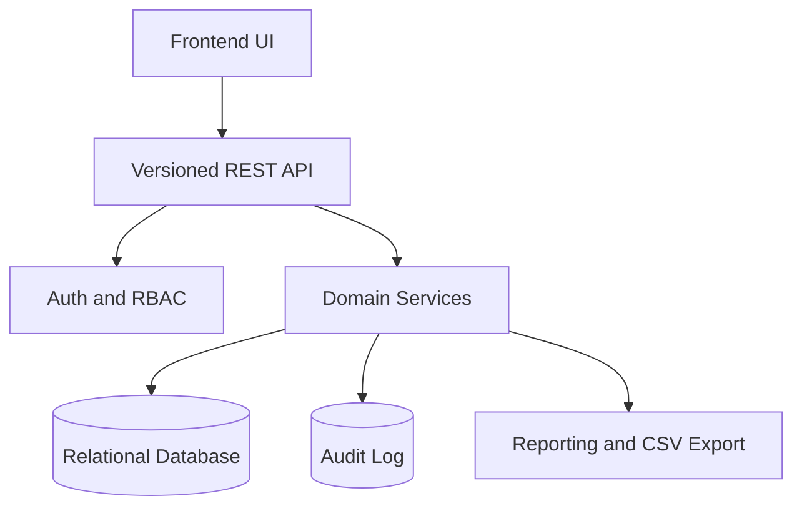

# Backend Development Overview

## Objective
Deliver a production-ready backend for the Workorders MVP that supports customer and workorder operations, billing, inventory, reporting, and role-based access control.

## MVP Scope Summary
In scope:
- authenticated role-based backend access (`sales_staff`, `technician`, `admin`)
- customer CRUD, search, and lifecycle-safe deletes
- workorder CRUD, status lifecycle transitions, assignment
- business-managed Service Module (`service_definition`) and service selection
- itemized billing with subtotal, tax, total, and optional payment metadata
- inventory item management and stock events
- report endpoints with CSV export
- audit events for sensitive workflows

Out of scope in MVP:
- payment gateway integration
- public external API integrations
- PDF/XLSX export formats
- multi-tenant architecture

## Architecture Direction
A layered backend architecture is required:
- API layer: authentication, role enforcement, request validation, response shaping
- domain/service layer: business rules for lifecycle, billing, inventory, reporting
- persistence layer: normalized entities and transactional operations
- audit/security layer: action logging, sensitive data controls, backup and recovery support

## Role Responsibilities
- `sales_staff`
  - customer and workorder intake/update
  - billing updates under allowed state rules
- `technician`
  - workorder status progress and notes
  - confirmed parts consumption updates
- `admin`
  - user/role administration
  - service and inventory administration
  - override actions and full report access

## Milestone Execution Order
1. Foundation and contracts
2. Core CRUD and lifecycle
3. Billing and inventory core
4. Reporting and responsive support integration
5. Hardening and readiness

## Delivery Constraints
- Service definitions are business-managed and not hardcoded.
- Workorders must reference active service definitions unless admin override is invoked.
- Sensitive credentials must not be persisted as plaintext.
- CSV is the only export format for MVP.

## Success Criteria
- all in-scope requirements implemented
- deterministic billing totals and tax calculations
- transactional inventory consistency
- role matrix enforced at endpoint and action levels
- traceability matrix updated with test evidence
