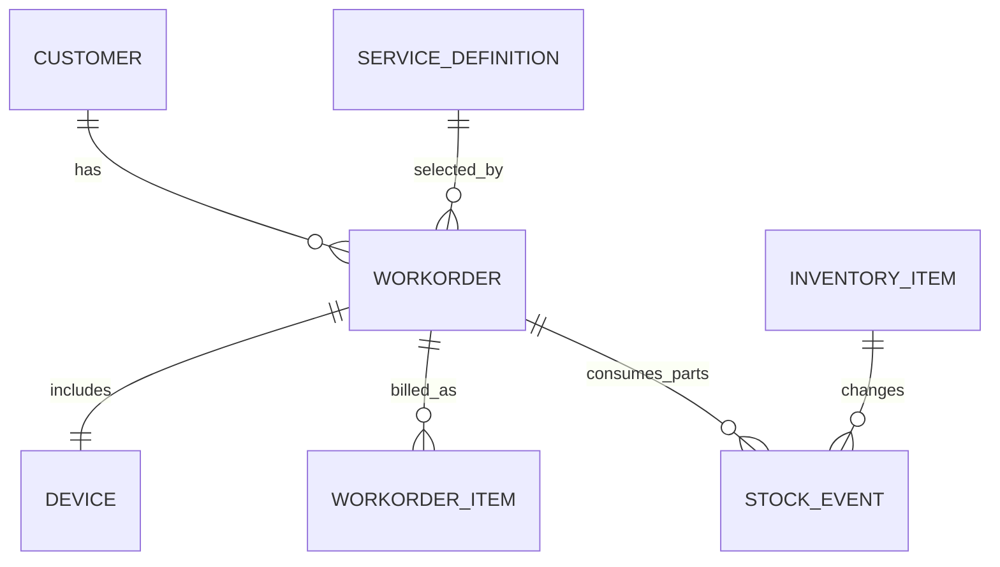
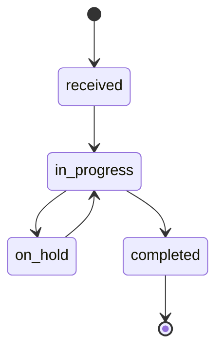

# Data Model and Lifecycle

## Purpose
Translate planning-level entity definitions into implementation guidance for models, constraints, and domain workflows.

## Core Entities

### customer
Required:
- id
- full_name
- contact_number

Optional:
- company_name
- email
- physical_address

### workorder
Required:
- id
- workorder_number
- customer_id
- service_definition_id
- service_location
- issue_description
- status
- date_received

Optional:
- estimated_completion_date
- date_completed
- assigned_technician_id
- internal_notes
- customer_notes

### device
Required:
- id
- workorder_id
- device_type
- manufacturer
- model

Optional:
- serial_number
- accessories_included
- condition
- operating_system
- software_installed
- credential_note_ref

### workorder_item
Required:
- id
- workorder_id
- item_type
- description
- quantity
- unit_price
- line_total

Optional:
- sku
- labor_hours
- hourly_rate

### service_definition
Required:
- id
- code
- name
- is_active

Optional:
- category
- description
- default_price
- billing_mode_default
- allow_partial_payment
- display_order

### billing_summary
Required:
- workorder_id
- subtotal
- tax_amount
- total

Optional:
- payment_status
- payment_method
- billing_mode
- check_number
- card_transaction_id

### inventory_item
Required:
- id
- sku
- description
- stock_on_hand

Optional:
- cost_price
- sell_price
- reorder_point
- reorder_quantity
- supplier_name

### stock_event
Required:
- id
- inventory_item_id
- event_type
- quantity_delta
- reason
- actor_user_id
- created_at

Optional:
- workorder_id

## Relationship Model
- customer 1:N workorder
- service_definition 1:N workorder
- workorder 1:1 device
- workorder 1:N workorder_item
- inventory_item 1:N stock_event
- workorder 1:N stock_event

## Service Module Rules
- service definitions are business-managed and not seeded as fixed defaults
- workorders must reference active services unless admin override is used
- prefer soft deletion or archival over hard deletion when historical references exist
- `service_location` values: `on_site`, `in_shop`, `other`

## Workorder Lifecycle
Allowed states:
- `received`
- `in_progress`
- `on_hold`
- `completed`

Allowed transitions:
- `received -> in_progress`
- `in_progress -> on_hold`
- `on_hold -> in_progress`
- `in_progress -> completed`

## Database Constraints
- `workorder_number` unique
- `inventory_item.sku` unique and immutable after creation
- `service_definition.code` unique
- non-labor line totals enforce `quantity * unit_price`
- labor lines require `labor_hours` and `hourly_rate`
- billing total enforces `subtotal + tax_amount`
- `date_completed` is null unless status is `completed`

## Indexing Strategy
- customer: `(full_name, company_name, email)`
- service_definition: `(code, name, is_active)`
- workorder: `(status, date_received, customer_id, service_definition_id)`
- device: `(serial_number)`
- inventory_item: `(sku, description)`
- stock_event: `(inventory_item_id, created_at)`

## Data Validation and Integrity Checks
- required field validation for all create/update operations
- foreign key integrity checks for all references
- state transition policy checks in domain layer
- computed field reconciliation checks on billing update/save
